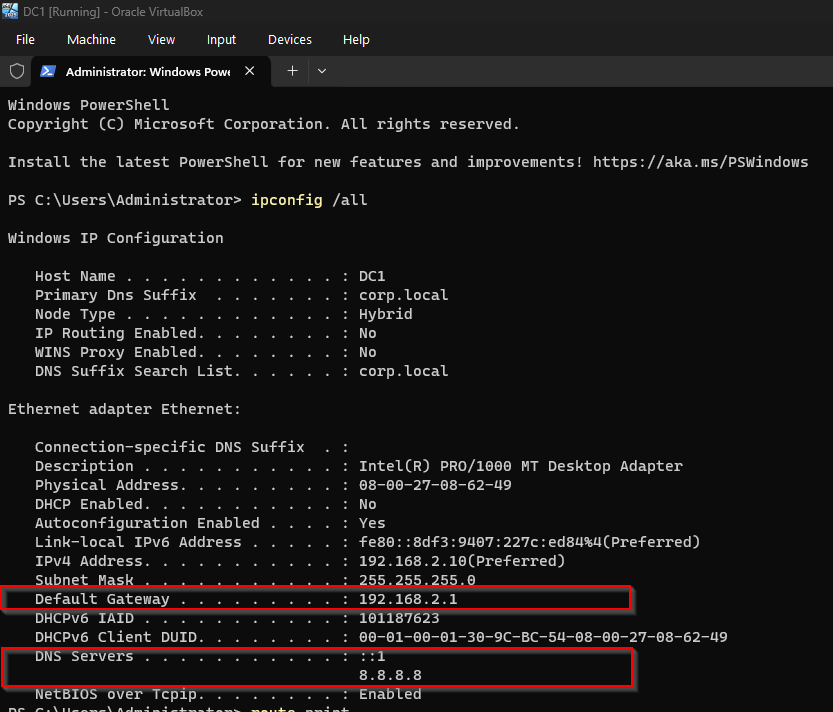
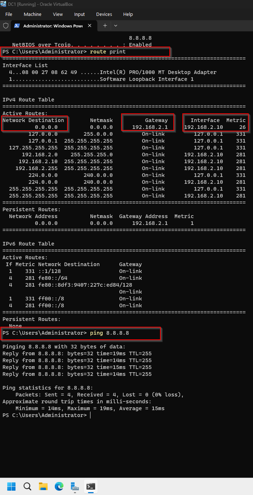
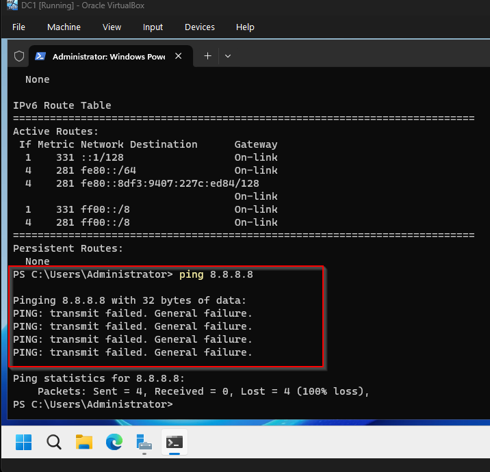
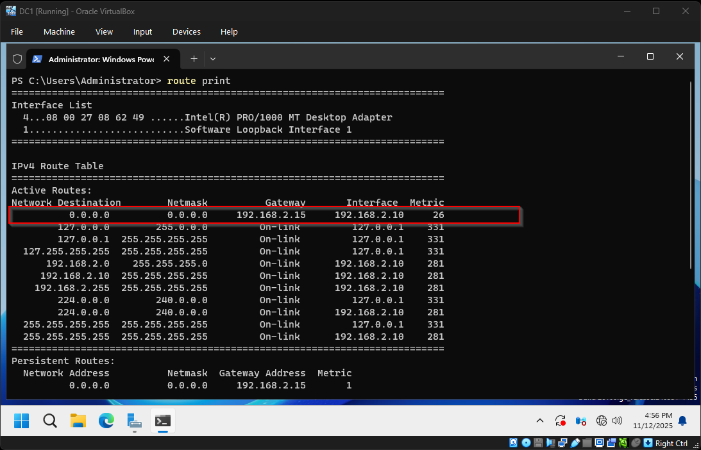
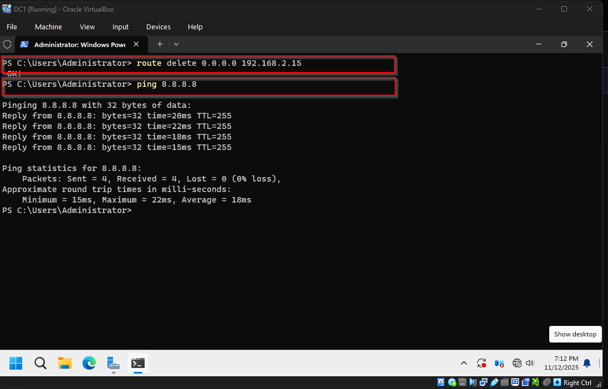
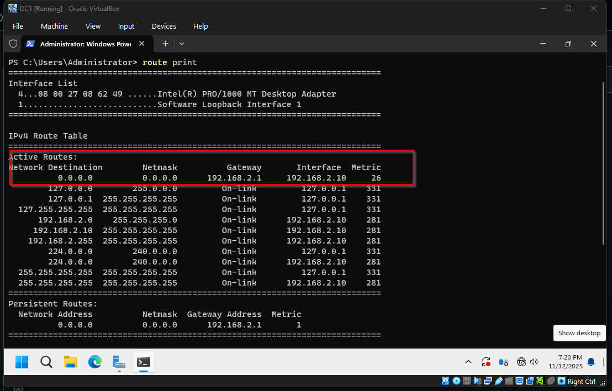

#Network Routing Issue Fix (Windows Server Lab)

---

## 🎯 Project Overview
This project demonstrates the troubleshooting and resolution of a **network routing issue** on a Windows Server (DC1) running in VirtualBox using a NAT network.  
The server lost internet connectivity due to a **bad default gateway route**.  

By recreating the issue and fixing it through route analysis and correction, I demonstrate practical troubleshooting skills applicable in **IT support**, **system administration**, and **SOC operations**.

---

## ⚙️ Environment Setup

| Component | Details |
|------------|----------|
| Virtualization | VirtualBox |
| Network Type | NAT |
| Network Range | 192.168.2.0/24 |
| NAT Gateway | 192.168.2.1 |
| DC1 IP | 192.168.2.10 |
| Tools Used | CMD, PowerShell, `route print`, `ipconfig` |
| OS | Windows Server (Domain Controller) |

> 💡 All commands were run as **Administrator** in a controlled lab setup.

---

## 🧱 Step 1 — Verify Initial Network Configuration

Check the server’s current network configuration and routing table.

```cmd
ipconfig /all
route print
```

Expected:
- Gateway: `192.168.2.1`
- Internet reachable (`ping 8.8.8.8` should reply)

**Screenshot:**  



---

## 💣 Step 2 — Simulate a Bad Gateway

Add a **wrong default route** to intentionally break internet access.

```cmd
route -p add 0.0.0.0 mask 0.0.0.0 192.168.2.15
```

Now test connectivity:

```cmd
ping 8.8.8.8
```

Expected: Request times out — **no internet**.

**Screenshots:**  
  


---

## 🧹 Step 3 — Fix the Issue (Delete the Bad Route)

Delete the incorrect gateway route from the routing table.

```cmd
route delete 0.0.0.0 192.168.2.15
```

Now verify again:

```cmd
route print
ping 8.8.8.8
```

✅ Internet connectivity restored successfully.

**Screenshot:**  


---

## 🔁 Step 4 — Make the Fix Persistent

Re-add the correct route permanently so it stays even after reboot.

```cmd
route -p add 0.0.0.0 mask 0.0.0.0 192.168.2.1
route print
```

✅ The correct default route (`192.168.2.1`) is now permanent.

**Screenshot:**  


---

## 📸 Screenshot Summary

| Step | Filename | Description |
|------|-----------|-------------|
| 1 | step_a_ipconfig_before.png | Initial configuration |
| 2 | step_b_after_bad_route_ping_fail.png | No internet after bad route |
| 2 | step_b_bad_route_table.png | Bad route visible |
| 3 | step_c_route_table_after_add_correct.png | Conflicting routes |
| 4 | step_d_route_delete_and_ping_working.png | Ping success after deleting bad route |
| 4 | step_d_readded_route_permamently.png | Confirmed persistent correct route |

---

## 🧩 Troubleshooting Notes

- Always run **CMD/PowerShell as Administrator**
- NAT gateway (`192.168.2.1`) must be reachable
- If multiple default gateways exist, Windows uses the lowest metric route
- Deleting the wrong one immediately restores connectivity
- Always confirm with `route print` before and after fixing

---

## 🧠 Reflection

This lab simulated and fixed a **network connectivity issue** caused by an incorrect route entry.  
It taught me:
- How routing works in Windows Server  
- How to diagnose connectivity using `route print` and `ping`  
- How to permanently fix a misconfigured route  
- The importance of systematic troubleshooting and documentation  

**Key Takeaways:**
- Simple command-line tools can fix complex network problems  
- Documentation makes troubleshooting repeatable  
- Understanding routing priority is critical in multi-adapter environments  

---

## 🧰 Skills Demonstrated

- Windows network troubleshooting  
- Route table analysis and correction  
- Command-line administration  
- Documentation and technical writing  

---

## ✅ Conclusion

By intentionally introducing a bad route and fixing it, I successfully restored internet access to my Windows Server (DC1).  
This project demonstrates effective troubleshooting, command-line proficiency, and clear technical documentation — skills essential in IT and cybersecurity operations.

**Result:** Internet restored ✅  
**Documentation:** Complete, professional, and portfolio-ready.

made by Szilard
